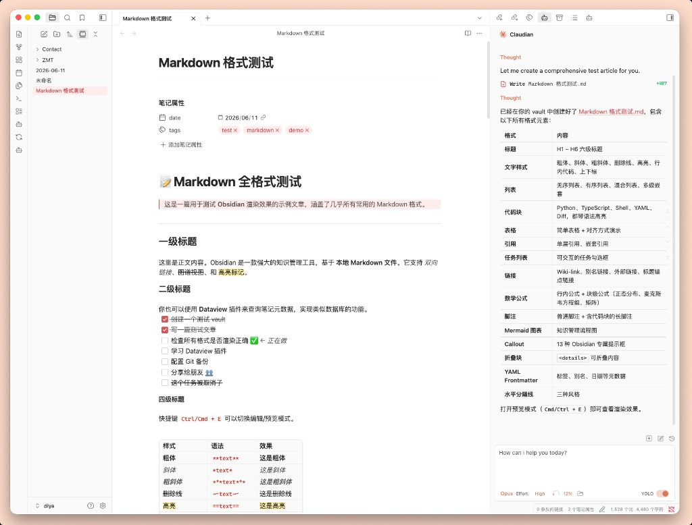
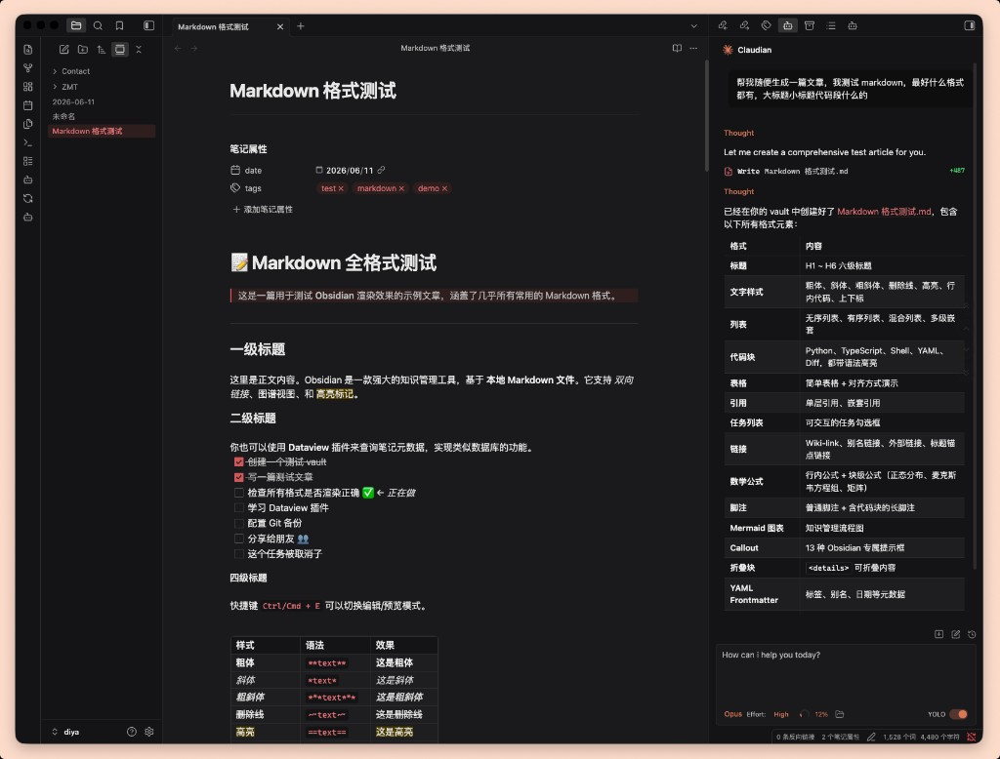
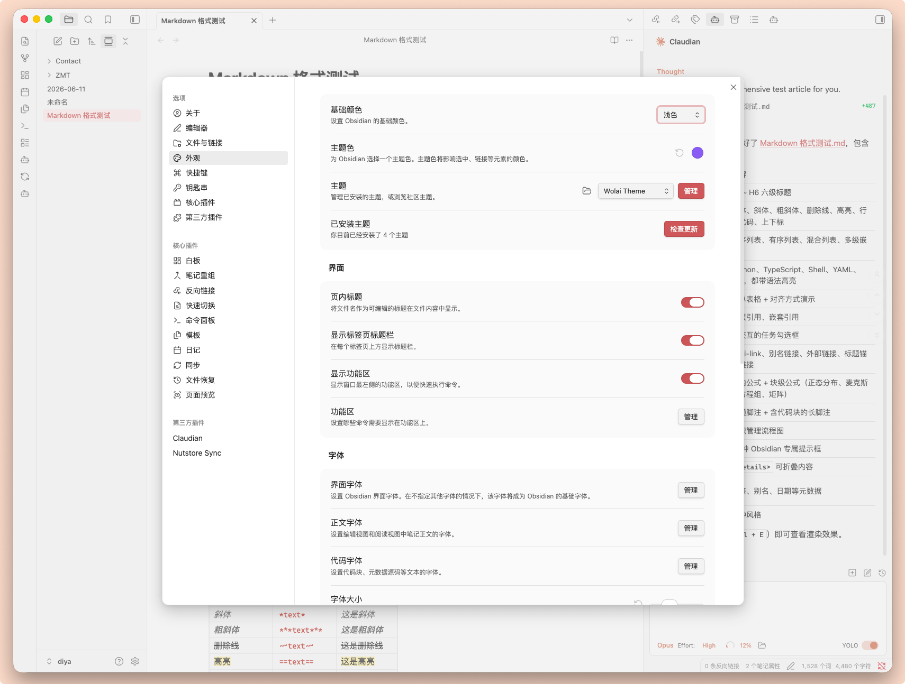

# Wolai

[](https://community.obsidian.md/themes/wolai)

一个受 [Wolai](https://www.wolai.com) 设计风格启发的 Obsidian 主题，追求简洁、现代的笔记体验。

也可在 [Obsidian 社区主题页](https://community.obsidian.md/themes/wolai) 查看详情并安装。

## 特性

- 干净简洁的视觉风格，减少视觉干扰
- 支持亮色 / 暗色双模式
- 中文字体优化（PingFang SC、Microsoft YaHei）
- 舒适的行距与排版，适合长时间阅读
- 优化的代码块、表格、引用块样式
- 圆角卡片式 UI 元素

## 安装

### 通过社区主题市场（推荐）

1. 打开 Obsidian → 设置 → 外观 → 主题 → 管理
2. 搜索 **Wolai**，点击安装

或访问社区主题页：[community.obsidian.md/themes/wolai](https://community.obsidian.md/themes/wolai)

### 手动安装

1. 从 [Releases](https://github.com/liicos/obsidian-wolai-theme/releases/latest) 下载 `theme.css` 和 `manifest.json`
2. 将文件放入你的 Obsidian vault 的 `.obsidian/themes/Wolai/` 目录
3. 打开 Obsidian → 设置 → 外观 → 主题，选择 **Wolai**

## 截图

### 亮色模式



### 暗色模式



### 主题设置



## 开发

```bash
# 克隆仓库
git clone https://github.com/liicos/obsidian-wolai-theme.git

# 将主题软链接到你的 vault（替换路径）
ln -s $(pwd) "/path/to/your/vault/.obsidian/themes/Wolai"
```

修改 `theme.css` 后刷新 Obsidian（Ctrl/Cmd+R）即可预览效果。

## 发布新版本

1. 更新 `manifest.json` 中的 `version`（遵循 [语义化版本](https://semver.org/lang/zh-CN/)，格式 `x.y.z`）
2. 提交并推送到 GitHub
3. 创建与版本号一致的 tag 并推送，例如：

```bash
git tag 1.0.1
git push origin 1.0.1
```

GitHub Actions 会自动创建 Release 并附上 `manifest.json` 与 `theme.css`。

## 链接

- 社区主题页：https://community.obsidian.md/themes/wolai
- GitHub 仓库：https://github.com/liicos/obsidian-wolai-theme
- 最新 Release：https://github.com/liicos/obsidian-wolai-theme/releases/latest

## License

MIT

---

## English

[](https://community.obsidian.md/themes/wolai)

An Obsidian theme inspired by the design of [Wolai](https://www.wolai.com), offering a clean and modern note-taking experience.

View the listing at [community.obsidian.md/themes/wolai](https://community.obsidian.md/themes/wolai).

### Features

- Clean, minimal visual style with reduced visual clutter
- Light and dark mode support
- Optimized Chinese typography (PingFang SC, Microsoft YaHei)
- Comfortable line spacing and layout for long reading sessions
- Styled code blocks, tables, and blockquotes
- Rounded, card-style UI elements

### Installation

**From the community theme store (recommended)**

1. Open Obsidian → Settings → Appearance → Themes → Manage
2. Search for **Wolai** and click Install

Or visit [community.obsidian.md/themes/wolai](https://community.obsidian.md/themes/wolai).

**Manual installation**

1. Download `theme.css` and `manifest.json` from [Releases](https://github.com/liicos/obsidian-wolai-theme/releases/latest)
2. Place them in `.obsidian/themes/Wolai/` inside your vault
3. Open Obsidian → Settings → Appearance → Themes, and select **Wolai**

### Links

- Community listing: https://community.obsidian.md/themes/wolai
- GitHub repository: https://github.com/liicos/obsidian-wolai-theme
- Latest release: https://github.com/liicos/obsidian-wolai-theme/releases/latest
